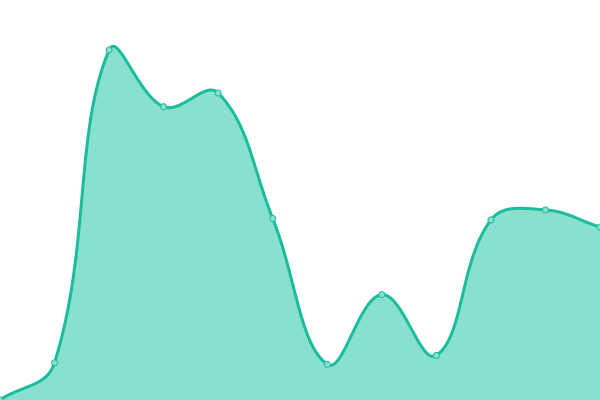
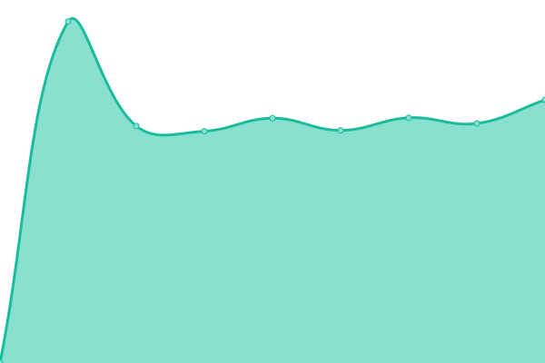
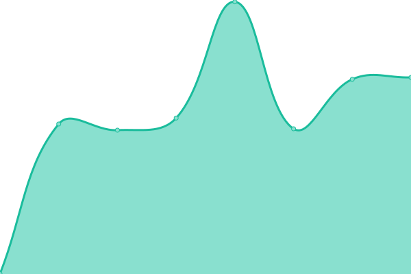
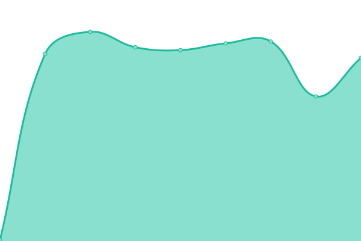
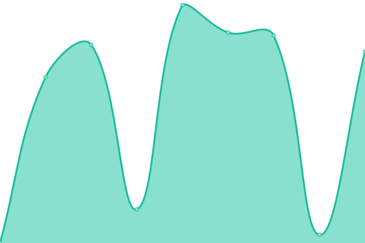
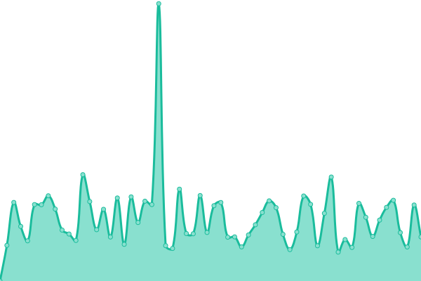

# [📈 Live Status](https://cavalicenti.github.io/upptime): <!--live status--> **🟧 Partial outage**

This repository contains the open-source uptime monitor and status page for [cavalicenti](https://cavalicenti.github.io/upptime), powered by [Upptime](https://github.com/upptime/upptime).

With [Upptime](https://upptime.js.org), you can get your own unlimited and free uptime monitor and status page, powered entirely by a GitHub repository. We use [Issues](https://github.com/cavalicenti/upptime/issues) as incident reports, [Actions](https://github.com/cavalicenti/upptime/actions) as uptime monitors, and [Pages](https://cavalicenti.github.io/upptime) for the status page.

<!--start: status pages-->
<!-- This summary is generated by Upptime (https://github.com/upptime/upptime) -->
<!-- Do not edit this manually, your changes will be overwritten -->
<!-- prettier-ignore -->
| URL | Status | History | Response Time | Uptime |
| --- | ------ | ------- | ------------- | ------ |
|  [Artfos](https://www.artfos.com.ar) | 🟥 Down | [artfos.yml](https://github.com/cavalicenti/upptime/commits/HEAD/history/artfos.yml) | 

 1673ms
     
 | 

<a href="https://cavalicenti.github.io/upptime/history/artfos">60.81%</a>
    

|  [Artfos ERP](https://intranet.artfos.com.ar/) | 🟩 Up | [artfos-erp.yml](https://github.com/cavalicenti/upptime/commits/HEAD/history/artfos-erp.yml) | 

 560ms
     
 | 

<a href="https://cavalicenti.github.io/upptime/history/artfos-erp">60.82%</a>
    

|  [OCEBA frontend](https://conreg-fe.oceba.gba.gov.ar) | 🟩 Up | [oceba-frontend.yml](https://github.com/cavalicenti/upptime/commits/HEAD/history/oceba-frontend.yml) | 

 2398ms
     
 | 

<a href="https://cavalicenti.github.io/upptime/history/oceba-frontend">100.00%</a>
    

|  [OCEBA Backend](https://conreg-be.oceba.gba.gov.ar) | 🟩 Up | [oceba-backend.yml](https://github.com/cavalicenti/upptime/commits/HEAD/history/oceba-backend.yml) | 

 4403ms
     
 | 

<a href="https://cavalicenti.github.io/upptime/history/oceba-backend">100.00%</a>
    

|  [Albanesi Backend](http://proveedores.albanesi.com.ar/web/index.php/site/login) | 🟩 Up | [albanesi-backend.yml](https://github.com/cavalicenti/upptime/commits/HEAD/history/albanesi-backend.yml) | 

 1413ms
     
 | 

<a href="https://cavalicenti.github.io/upptime/history/albanesi-backend">100.00%</a>
    

|  [Albanesi Frontend](http://proveedores.albanesi.com.ar) | 🟩 Up | [albanesi-frontend.yml](https://github.com/cavalicenti/upptime/commits/HEAD/history/albanesi-frontend.yml) | 

 352ms
     
 | 

<a href="https://cavalicenti.github.io/upptime/history/albanesi-frontend">100.00%</a>
    

|  [BA Anglers](https://www.buenosairesanglers.com/) | 🟩 Up | [ba-anglers.yml](https://github.com/cavalicenti/upptime/commits/HEAD/history/ba-anglers.yml) | 

 1926ms
     
 | 

<a href="https://cavalicenti.github.io/upptime/history/ba-anglers">100.00%</a>
    

|  [Janax Soft](https://www.janaxsoftware.com.ar/) | 🟩 Up | [janax-soft.yml](https://github.com/cavalicenti/upptime/commits/HEAD/history/janax-soft.yml) | 

 3847ms
     
 | 

<a href="https://cavalicenti.github.io/upptime/history/janax-soft">100.00%</a>
    

|  [Mas Valores](https://www.masvalores.com.ar/) | 🟩 Up | [mas-valores.yml](https://github.com/cavalicenti/upptime/commits/HEAD/history/mas-valores.yml) | 

 913ms
     
 | 

<a href="https://cavalicenti.github.io/upptime/history/mas-valores">100.00%</a>
    

|  [TR66](https://www.transportesruta66.com.ar/) | 🟥 Down | [tr-66.yml](https://github.com/cavalicenti/upptime/commits/HEAD/history/tr-66.yml) | 

 945ms
     
 | 

<a href="https://cavalicenti.github.io/upptime/history/tr-66">86.94%</a>
    

<!--end: status pages-->

[**Visit our status website →**](https://cavalicenti.github.io/upptime)

## 📄 License

- Powered by: [Upptime](https://github.com/upptime/upptime)
- Code: [MIT](./LICENSE) © [cavalicenti](https://cavalicenti.github.io/upptime)
- Data in the `./history` directory: [Open Database License](https://opendatacommons.org/licenses/odbl/1-0/)
