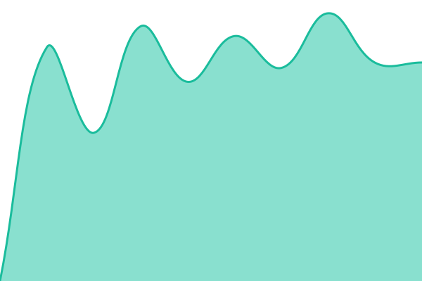
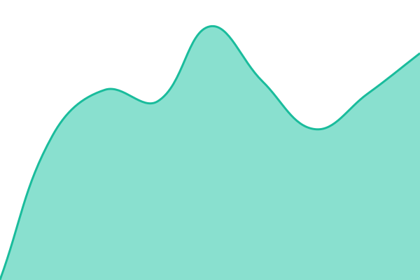
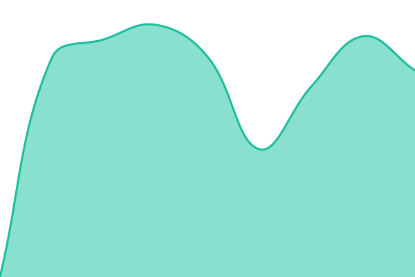
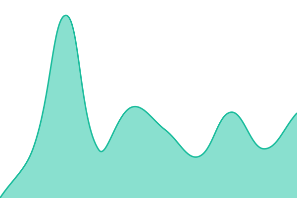
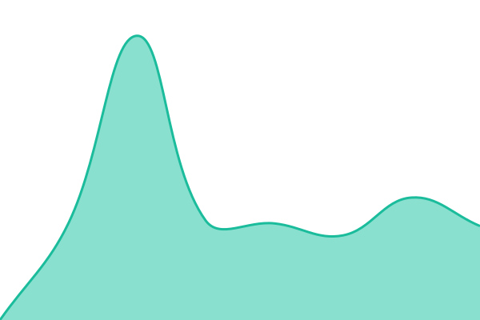

# [📈 Live Status](https://cavalicenti.github.io/upptime): <!--live status--> **🟧 Partial outage**

This repository contains the open-source uptime monitor and status page for [cavalicenti](https://cavalicenti.github.io/upptime), powered by [Upptime](https://github.com/upptime/upptime).

With [Upptime](https://upptime.js.org), you can get your own unlimited and free uptime monitor and status page, powered entirely by a GitHub repository. We use [Issues](https://github.com/cavalicenti/upptime/issues) as incident reports, [Actions](https://github.com/cavalicenti/upptime/actions) as uptime monitors, and [Pages](https://cavalicenti.github.io/upptime) for the status page.

<!--start: status pages-->
<!-- This summary is generated by Upptime (https://github.com/upptime/upptime) -->
<!-- Do not edit this manually, your changes will be overwritten -->
<!-- prettier-ignore -->
| URL | Status | History | Response Time | Uptime |
| --- | ------ | ------- | ------------- | ------ |
|  [00-Artfos](https://www.artfos.com.ar) | 🟩 Up | [00-artfos.yml](https://github.com/cavalicenti/upptime/commits/HEAD/history/00-artfos.yml) | 

 4433ms
     
 | 

<a href="https://cavalicenti.github.io/upptime/history/00-artfos">93.80%</a>
    

|  [00-Artfos ERP](https://intranet.artfos.com.ar/) | 🟩 Up | [00-artfos-erp.yml](https://github.com/cavalicenti/upptime/commits/HEAD/history/00-artfos-erp.yml) | 

 874ms
     
 | 

<a href="https://cavalicenti.github.io/upptime/history/00-artfos-erp">93.95%</a>
    

|  [00-Janax Soft](https://www.janaxsoftware.com.ar/) | 🟩 Up | [00-janax-soft.yml](https://github.com/cavalicenti/upptime/commits/HEAD/history/00-janax-soft.yml) | 

 4199ms
     
 | 

<a href="https://cavalicenti.github.io/upptime/history/00-janax-soft">94.09%</a>
    

|  [15-Mas Valores](https://www.masvalores.com.ar/) | 🟩 Up | [15-mas-valores.yml](https://github.com/cavalicenti/upptime/commits/HEAD/history/15-mas-valores.yml) | 

 1155ms
     
 | 

<a href="https://cavalicenti.github.io/upptime/history/15-mas-valores">94.23%</a>
    

|  [20-TR66](https://www.transportesruta66.com.ar/) | 🟩 Up | [20-tr-66.yml](https://github.com/cavalicenti/upptime/commits/HEAD/history/20-tr-66.yml) | 

 2641ms
     
 | 

<a href="https://cavalicenti.github.io/upptime/history/20-tr-66">94.38%</a>
    

|  [31-OCEBA frontend](https://conreg-fe.oceba.gba.gov.ar) | 🟩 Up | [31-oceba-frontend.yml](https://github.com/cavalicenti/upptime/commits/HEAD/history/31-oceba-frontend.yml) | 

 1504ms
     
 | 

<a href="https://cavalicenti.github.io/upptime/history/31-oceba-frontend">95.71%</a>
    

|  [31-OCEBA Backend](https://conreg-be.oceba.gba.gov.ar) | 🟩 Up | [31-oceba-backend.yml](https://github.com/cavalicenti/upptime/commits/HEAD/history/31-oceba-backend.yml) | 

 3946ms
     
 | 

<a href="https://cavalicenti.github.io/upptime/history/31-oceba-backend">95.71%</a>
    

|  [37-Albanesi Backend](http://proveedores.albanesi.com.ar/web/index.php/site/login) | 🟥 Down | [37-albanesi-backend.yml](https://github.com/cavalicenti/upptime/commits/HEAD/history/37-albanesi-backend.yml) | 

 0ms
     
 | 

<a href="https://cavalicenti.github.io/upptime/history/37-albanesi-backend">0.00%</a>
    

|  [37-Albanesi Frontend](http://proveedores.albanesi.com.ar) | 🟥 Down | [37-albanesi-frontend.yml](https://github.com/cavalicenti/upptime/commits/HEAD/history/37-albanesi-frontend.yml) | 

 990ms
     
 | 

<a href="https://cavalicenti.github.io/upptime/history/37-albanesi-frontend">29.31%</a>
    

<!--end: status pages-->

[**Visit our status website →**](https://cavalicenti.github.io/upptime)

## 📄 License

- Powered by: [Upptime](https://github.com/upptime/upptime)
- Code: [MIT](./LICENSE) © [cavalicenti](https://cavalicenti.github.io/upptime)
- Data in the `./history` directory: [Open Database License](https://opendatacommons.org/licenses/odbl/1-0/)
